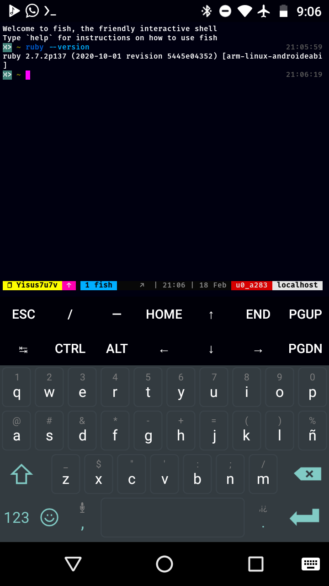
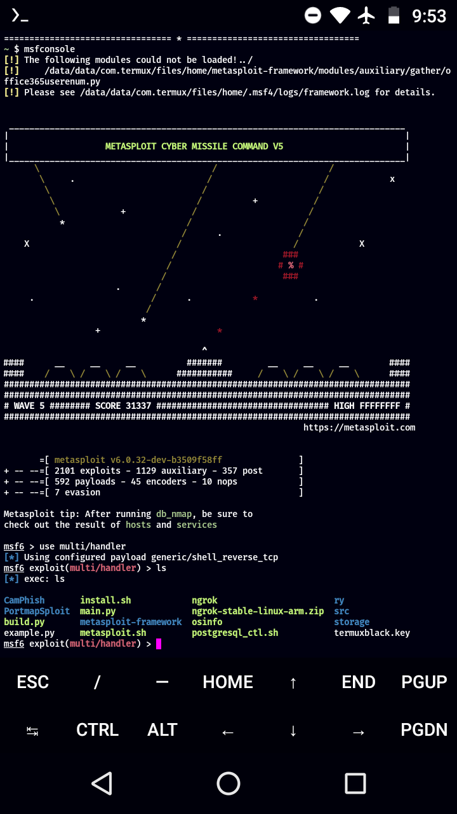

# Metasploit_by-yisus
Este instalador instalará Metasploit en termux solucionando el error de ruby 3.0.0 

Termux actualizo ruby a la versión 3.0.0, Metasploit funciona con ruby 2.7.2, 
Pero yo e encontrado solucion al problema, sigue 
estos pasos:

SIGUE LOS SIGUIENTES PASOS EN ORDEN :
!es recomendable usar Android 7 en adelante!

# ruby 2.7.2

primero eliminamos la versión 3.0.0 de ruby:

pkg uninstall ruby

Ahora añadiremos el repositorio de hbhacker
(Gracias abhacker por mantener una compilación
de ruby en tus repositorios!!)

pkg install curl 

bash -c "$(curl -fsSL https://bit.do/abhacker-repo)"

si no te funciona este comando sigue las instrucciones 
en su repositorio oficial :
https://github.com/abhackerofficial/abhacker.repo

Nota (si estas usando fish o zsh cambia tu 
terminal a bash)

Luego actualizamos:

pkg update && pkg upgrade 

Ahora instalamos ruby 2.7.2 :

pkg install ruby2

# No sirvió?, instala el 
paquete manualmente, para saber tu arquitectura 
usa el comando :

uname -m

Luego de saber tu arquitectura descarga el 
paquete compatible con ella :

# Binario para Armv7l y otros celulares ARM:

pkg add libyaml libffi gdbm perl tar proot aapt

wget https://github.com/abhackerofficial/abhacker.repo/raw/master/dists/abhacker/main/binary-arm/ruby.deb

dpkg -i ruby.deb

# Binario Pará aarch64 :

pkg add libyaml libffi gdbm perl tar proot aapt

wget https://github.com/abhackerofficial/abhacker.repo/blob/master/dists/abhacker/main/binary-aarch64/ruby.deb

dpkg -i ruby.deb

# Binario para i686 :

pkg add libyaml libffi gdbm perl tar proot aapt

wget https://github.com/abhackerofficial/abhacker.repo/blob/master/dists/abhacker/main/binary-i686/ruby.deb

dpkg -i ruby.deb 

# Binario para x86_64 :

pkg add libyaml libffi gdbm perl tar proot aapt

wget https://github.com/abhackerofficial/abhacker.repo/blob/master/dists/abhacker/main/binary-x86_64/ruby.deb

dpkg -i ruby.deb 

# exelente

ahora comprobamos que tenemos ruby 2.7.2 :

ruby --version

Nos debe salir esto :

                             
con que salga 2.7.2 ya todo va correcto

# conjelar actualizaciones 

Luego de tener ruby 2.7.2, conjelaremos sus actualizaciones 
para evitar que se actualize :

apt-mark hold ruby

Luego :

pkg update && pkg upgrade, luego de esto veras
que termux no actualizará ruby a la versión 3.0.0 

# instalación de Metasploit

Primero clone este repositorio 

cd $HOME

git clone https://github.com/Yisus7u7/Metasploit_by-yisus 

chmod +x ~/Metasploit_by-yisus/*

mv ~/Metasploit_by-yisus/metasploit.sh $HOME

Ahora ejecute :

bash metasploit.sh

O

./metasploit.sh

# créditos :

Gracias gushmazuko, hice solo una muy pequeña
edición de tu script, y me gusta gente como tu,
que no cifran sus scripts "para que no los copien" 
y los scripts que hacen no tienen sentido o son
solo bobadas 

Repositorio de gushmazuko:
https://github.com/gushmazuko/metasploit_in_termux 

abhaker, gracias por alojar ruby 2.7.2 en tus
repositorios, gracias por eso de ante mano

Repositorio de abhacker :

https://github.com/abhackerofficial/abhacker.repo

# Manifiesto

puedes hacer reviews en tu blog, página canal de 
YouTube etc.., también puedes crear un repositorio 
con un script para que toda esta instalación 
sea más fácil, siempre y cuando dejes créditos 🙂🌟

# apoyame!!

Buscame en tik tok como: @yisus7u7v

en YouTube : https://youtube.com/channel/UCjUSc4m0DpPgJ3iHNZtQmQw
